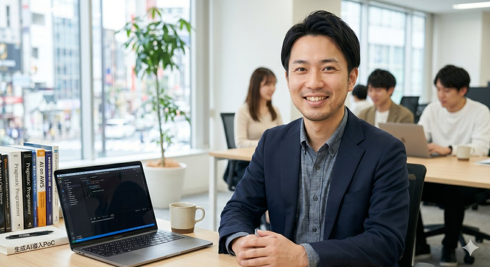

# ペルソナ & ジャーニーマップ

## ペルソナ設計の前提

ポノテクのビジネスポジショニング（伴走型・AI活用・ZERO-SaaS・中小〜中堅企業向け）から、以下3ペルソナを設定する。

---

## ペルソナ A：「業務デジタル化を急ぐ中小企業の経営者」


### 基本プロファイル

| 項目 | 詳細 |
|------|------|
| 名前 | 田中 誠（仮） |
| 年齢 | 48歳 |
| 役職 | 製造業・中小企業 代表取締役 |
| 規模 | 従業員30名・年商3億円 |
| ITリテラシー | 低〜中（スマホ・Excelは使える） |
| 課題 | 受発注管理・在庫管理がすべてExcel、属人化が深刻 |
| 予算感 | 初期費用300万円以上は稟議が通らない |
| 意思決定 | 自分で最終決定。信頼できる人の紹介や実績を重視 |

### 現在のジャーニーマップ（AS-IS）

```
[認知] → [情報収集] → [検討] → [相談] → [決断]
```

| フェーズ | 行動 | タッチポイント | ペイン | ゲイン |
|---------|------|--------------|--------|--------|
| **認知** | 知り合いの経営者から「AIで業務改善できるらしい」と聞く | 口コミ・異業種交流会 | 「何から始めたらいいかわからない」 | 「うちでもできるかも」という期待感 |
| **情報収集** | Googleで「中小企業 業務システム 開発 費用」等を検索。ポノテクのサイトを発見 | Google検索・コーポレートサイト | ・サービスの違いが分からない<br>・費用感がつかめない<br>・「伴走型」の意味がピンとこない | ZERO-SaaSで初期費用0円という点に興味を持つ |
| **検討** | サイトを複数社比較。ポノテクは実績が少なく不安を感じる。他社（大手・ノーコード）との比較検討 | コーポレートサイト・比較サイト | ・事例が少ない・詳細がない<br>・会社の規模感・信頼性が分からない<br>・「本当に2〜6週間で作れるのか？」 | 「無料相談」があるので一度聞いてみようかと思う |
| **相談前躊躇** | フォームを開くが「いきなり相談は敷居が高い」と感じて離脱 | お問い合わせフォーム | ・何を準備すべきか分からない<br>・営業されそうで怖い<br>・断れなくなりそう | — |
| **相談** | （別ルート）知人経由で紹介を受けて相談 | 紹介・電話 | 準備不足で会話がかみ合わない | 担当者の丁寧さに安心感を得る |
| **決断** | 費用対効果・担当者への信頼で判断 | 提案書・見積 | 「月額がずっと続くのはどうか」という不安 | 「初期0円でリスクが低い」という安心感 |

### ペイン・ゲイン整理

**ペイン（痛み・不満）**
- P1: 費用が不透明・初期投資リスクへの恐れ
- P2: 発注経験がなく、何を準備すべきか不明
- P3: 大手SIerには頼みにくいが、零細は不安
- P4: 「伴走型」「生成AI」など専門用語が分からない
- P5: 相談フォームへの心理的ハードル

**ゲイン（得たいこと）**
- G1: 初期費用ゼロで本格的なシステムを持てる
- G2: 業務属人化を解消して経営を安定させたい
- G3: 信頼できるパートナーに継続的に任せたい
- G4: 短期間で効果を実感したい

---

## ペルソナ B：「AIで差別化を図りたい事業部長・マネージャー」



### 基本プロファイル

| 項目 | 詳細 |
|------|------|
| 名前 | 鈴木 彩香（仮） |
| 年齢 | 38歳 |
| 役職 | 中堅企業 デジタル推進部 部長 |
| 規模 | 従業員200名・年商20億円 |
| ITリテラシー | 高（SaaSツール導入経験あり、ChatGPT活用中） |
| 課題 | 社内でのAI活用を推進したいが、具体的な事例・ノウハウが不足 |
| 予算感 | 年間500〜1000万円の予算を持つ |
| 意思決定 | 稟議を通す必要あり。社長説得のためのビジネス事例が必要 |

### 現在のジャーニーマップ（AS-IS）

| フェーズ | 行動 | タッチポイント | ペイン | ゲイン |
|---------|------|--------------|--------|--------|
| **認知** | LinkedInやTwitter(X)でAI活用事例を収集中にポノテクのnote記事を発見 | SNS・note | 「信頼できる情報源かどうか分からない」 | 「ComfyUI本を書いている会社か、面白い」 |
| **情報収集** | サイトを訪問。AIコンサルの内容を確認するが、具体的な支援内容・費用感が不明 | コーポレートサイト | ・サービスの具体性が薄い<br>・費用レンジが分からない<br>・実績企業・規模感が不明 | サービスへの興味は持続 |
| **検討** | 複数のAIコンサル会社を比較。ポノテクは会社規模・実績件数で不安を感じる | 比較検討・口コミ | ・会社の規模が小さそう<br>・稟議を通せるだけの実績・エビデンスがない | 「伴走型」の姿勢は魅力的に映る |
| **相談前** | 無料相談フォームから問い合わせを検討。フォームに項目が少なく何が得られるか不明 | お問い合わせページ | 「この相談で何を得られるのか分からない」 | — |
| **相談** | メールで問い合わせ → レスポンスを受けて面談 | メール・オンライン面談 | 担当レベル・専門性への疑問 | 具体的な提案に満足感 |
| **決断** | 社内稟議提出。実績エビデンス不足で承認に時間がかかる | 提案書・社内稟議 | 「社長に見せる実績資料が少ない」 | — |

### ペイン・ゲイン整理

**ペイン**
- P1: 会社規模の信頼性（大手に比べて実績エビデンスが薄い）
- P2: AIコンサルの具体的な支援スコープが不明
- P3: 社内稟議を通すための根拠資料が作れない
- P4: 費用感・ROIの算出ができない

**ゲイン**
- G1: 社内AI活用の成功事例を作って評価を得たい
- G2: 専門家との継続的なパートナーシップを持ちたい
- G3: 競合より先にAI活用で差別化を実現したい

---

## ペルソナ C：「協業・案件紹介を検討するパートナー企業担当者」

### 基本プロファイル

| 項目 | 詳細 |
|------|------|
| 名前 | 佐々木 健（仮） |
| 年齢 | 42歳 |
| 役職 | IT系コンサル・会計事務所 パートナー |
| 規模 | 小規模専門会社 |
| 課題 | 顧客からのシステム開発・DX相談を受けるが、自社では対応できない |
| 動機 | 信頼できる開発パートナーを探している |

### 現在のジャーニーマップ（AS-IS）

| フェーズ | 行動 | タッチポイント | ペイン | ゲイン |
|---------|------|--------------|--------|--------|
| **認知** | 知人のコンサルタントからポノテクを紹介される | 口コミ・紹介 | 「知らない会社で不安」 | 「紹介パートナー制度があるのは面白い」 |
| **情報収集** | サイトで紹介パートナー制度を確認するが、制度詳細・収益モデルが不明 | コーポレートサイト | ・制度の詳細がサイトに記載されていない<br>・どんな案件を紹介できるのか不明 | — |
| **相談** | 問い合わせフォームで連絡 | フォーム | 「パートナー向けの専用窓口がない」 | — |

### ペイン・ゲイン整理

**ペイン**
- P1: パートナー制度の詳細が分からない（LP未整備）
- P2: 紹介した場合の収益イメージが描けない
- P3: ポノテクの技術範囲・得意領域が不明確

**ゲイン**
- G1: 顧客への付加価値提供で自社の評価を上げたい
- G2: 安定した紹介収益を得たい
- G3: 信頼できる技術パートナーを持ちたい

---

## TOBEジャーニーマップ

### ペルソナA（中小企業経営者）向け TOBE

```
[認知] → [共感・理解] → [自己診断] → [段階的接触] → [確信] → [相談] → [成約]
```

| フェーズ | 理想の体験 | 必要なUX要素 |
|---------|------------|-------------|
| **認知** | 「初期費用0でシステム化できる」というキーワードでSEO流入 | SEO最適化されたコンテンツ・ブログ |
| **共感・理解** | 「うちと同じ課題だ」と感じる業種別事例を発見 | 業種別・課題別の導線と事例ページ |
| **自己診断** | 「自分の課題はこれに当てはまる」と確認できる | 課題セルフチェックツール or FAQ |
| **段階的接触** | いきなり相談ではなく「まずはお役立ち資料DL」という選択肢 | 資料DL・メルマガ登録のマイクロCTA |
| **確信** | 費用感・開発フロー・期間が具体的に理解できる | サービス詳細ページ・費用シミュレーター |
| **相談** | 「何を準備すべきか」が分かった状態で相談できる | 相談前チェックリスト・Chatbot事前ヒアリング |
| **成約** | ZERO-SaaSの月額モデルへの不安が解消されている | 解約・変更条件の明示・FAQ |

### ペルソナB（事業部長）向け TOBE

| フェーズ | 理想の体験 | 必要なUX要素 |
|---------|------------|-------------|
| **認知** | note記事・LinkedIn投稿からサイトへ誘導 | SNSシェアしやすいコンテンツ設計 |
| **信頼構築** | 書籍・登壇・メディア掲載等の権威性を確認できる | 実績・メディア掲載セクション |
| **課題マッチング** | 自社の課題がAIコンサルで解決できることを確認 | ユースケース別の解説ページ |
| **稟議支援** | 社内提案に使える資料・ROI算出ができる | 導入事例PDF・ROI計算ツール |
| **相談** | オンライン面談の日程が即時予約できる | Calendly連携などのオンライン予約 |

### ペルソナC（パートナー）向け TOBE

| フェーズ | 理想の体験 | 必要なUX要素 |
|---------|------------|-------------|
| **認知** | パートナー専用LP経由で制度を把握 | パートナー向け専用LP |
| **理解** | 紹介制度の収益モデル・条件が明確に分かる | 制度詳細・報酬体系の明示 |
| **申請** | オンラインで簡単に登録申請できる | パートナー登録フォーム |
